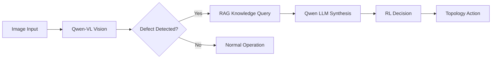
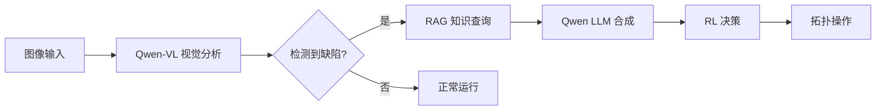

# PowerNexus ⚡

<div align="center">

[English](#english) | [中文](#中文)

[](https://www.python.org/downloads/)
[](https://pytorch.org/)
[](https://opensource.org/licenses/MIT)
[](https://streamlit.io/)

**An Intelligent Power Grid Inspection and Decision System Powered by Qwen2.5**


</div>

---

<a name="english"></a>
## 🇬🇧 English

### 📖 Overview

PowerNexus is an intelligent power grid inspection and decision-support system based on the **Qwen2.5** large language model family. It integrates:

- **Qwen2.5-VL** for visual defect detection in power equipment
- **Qwen2.5** for knowledge retrieval and natural language understanding
- **PPO Reinforcement Learning** for grid topology optimization
- **RAG (Retrieval-Augmented Generation)** for technical knowledge base

### ✨ Features

| Module | Description |
|--------|-------------|
| 🔍 **Vision Analysis** | Detect defects using **Qwen2.5-VL API** and get RAG-based technical guidance |
| 📚 **Knowledge Retrieval** | RAG-based technical Q&A with **API-based embeddings** and synthesized answers |
| 🤖 **RL Optimization** | PPO agent with LLM-generated explanations for grid topology actions |
| 📊 **Dashboard** | Streamlit-based interface with model status and knowledge base update tools |

### 📥 Input & 📤 Output

#### 🔹 System Input
- **Equipment Images**: `.jpg`, `.jpeg`, `.png` photos of power grid infrastructure (insulators, transformers, etc.).
- **Knowledge Documents**: Technical manuals, maintenance guides, and standards in `.pdf`, `.md`, or `.txt` formats.
- **Natural Language Queries**: Questions regarding equipment maintenance, fault diagnosis, or technical standards.
- **Grid Telemetry**: Real-time or simulated grid state data (line loads, voltages, etc.).

#### 🔸 System Output
- **Intelligent Diagnosis**: Multi-modal analysis results including defect type, confidence, and severity.
- **Expert Guidance**: LLM-synthesized technical suggestions strictly based on retrieved technical standards (RAG).
- **Topology Optimization**: Recommended grid topology actions (e.g., line switching) to optimize load distribution.
- **Unified Reports**: Comprehensive, professional inspection and maintenance reports.

### 🏗️ Architecture

```
PowerNexus/
├── config/
│   └── settings.py          # Global configuration (model paths, etc.)
├── src/
│   ├── app.py                # Streamlit dashboard
│   ├── perception/           # Vision module (Qwen2.5-VL)
│   │   └── vision_model.py
│   ├── rag/                   # RAG module
│   │   ├── ingest.py         # Document ingestion
│   │   └── retriever.py      # Knowledge retrieval
│   ├── rl_engine/            # Reinforcement Learning module
│   │   ├── agent.py          # PPO agent
│   │   └── env_wrapper.py    # Grid2Op environment wrapper
│   └── utils/
│       └── llm_engine.py     # Qwen LLM engine
├── tools/
│   └── simulate_grid_state.py  # Grid state data generator
├── data/
│   ├── grid_states.npz       # Pre-generated grid states
│   └── vector_db/            # ChromaDB vector store
└── models/
    └── rl/                   # Saved RL models
```

### 🔄 Workflow



1. **See**: Qwen2.5-VL analyzes power equipment images for defects
2. **Think**: RAG retrieves relevant technical standards and guidelines
3. **Decide**: PPO agent recommends optimal topology actions
4. **Act**: Execute grid operations with LLM-generated explanations

### 🚀 Quick Start

#### Prerequisites

- Python 3.10+
- CUDA 11.8+ (for GPU acceleration)
- 16GB+ GPU memory (recommended for 7B models)

#### Installation

```bash
# Clone the repository
git clone https://github.com/TanXiaoke/PowerNexus.git
cd PowerNexus

# Install dependencies
pip install -r requirements.txt
```

#### Configuration

Edit `config/config.yaml` to set your API endpoints:

```yaml
qwen_vl:
  api_base_url: "http://your-api:8120/v1"
  api_key: "no-key-required"
  model_name: "Qwen2.5-VL-7B-Instruct"

rag:
  embedding_api_base_url: "http://your-api:8116/v1"
  embedding_model: "all-MiniLM-L6-v2"
```

#### Run

```bash
# Generate grid state data
python tools/simulate_grid_state.py -n 100 -s mixed -o data/grid_states.npz

# Launch Streamlit dashboard
streamlit run src/app.py
```

#### Document Ingestion (RAG Knowledge Base)

To use the RAG knowledge retrieval feature, you need to ingest your documents (PDF, TXT, Markdown) into the vector database:

```bash
# Ingest a single PDF file
python tools/ingest_pdf.py data/manuals/your_document.pdf

# Or place documents in the manuals folder and ingest all
python -c "
from src.rag.ingest import DocumentIngestor, IngestConfig
ingestor = DocumentIngestor(IngestConfig())
ingestor.ingest_directory('data/manuals')
"
```

**Supported formats**: `.pdf`, `.txt`, `.md`, `.markdown`

> **Note**: The embedding model (`all-MiniLM-L6-v2`) may take 1-2 minutes to load on first run.

###📦 Dependencies

#### Core Dependencies

| Package | Version | Description |
|---------|---------|-------------|
| openai | ≥1.0.0 | **Primary API Client** for all LLM/VL/Embedding models |
| pypdf | ≥4.0.0 | PDF document parser for knowledge ingestion |
| torch | ≥2.0.0 | PyTorch deep learning framework |
| transformers | ≥4.41.0 | Hugging Face Transformers |
| streamlit | ≥1.40.0 | Web dashboard framework |
| stable-baselines3 | ≥2.0.0 | RL algorithms (PPO) |
| grid2op | ≥1.12.0 | Power grid simulation |
| chromadb | ≥1.3.0 | Vector database for RAG |
| sentence-transformers | ≥5.0.0 | Text embeddings (API-based) |
| langchain | ≥1.0.0 | LLM application framework |

#### Full Requirements

```txt
# Core ML
torch>=2.0.0
transformers>=4.41.0
accelerate>=1.0.0

# LLM & RAG
openai>=1.0.0
pypdf>=4.0.0
langchain>=1.0.0
chromadb>=1.3.0
sentence-transformers>=5.0.0

# Reinforcement Learning
stable-baselines3>=2.0.0
grid2op>=1.12.0
gymnasium>=1.2.0

# Web Dashboard
streamlit>=1.40.0
altair>=5.0.0
plotly>=5.0.0

# Utilities
numpy>=1.24.0
pandas>=2.0.0
Pillow>=10.0.0
pyyaml>=6.0.0
tqdm>=4.65.0
```

---

<a name="中文"></a>
## 🇨🇳 中文

### 📖 概述

PowerNexus 是一个基于 **Qwen2.5** 大语言模型家族的电网智能巡检与决策支持系统，集成了：

- **Qwen2.5-VL** 用于电力设备视觉缺陷检测
- **Qwen2.5** 用于知识检索和自然语言理解
- **PPO 强化学习** 用于电网拓扑优化
- **RAG（检索增强生成）** 用于技术知识库

### ✨ 功能特性

| 模块 | 描述 |
|------|------|
| 🔍 **视觉分析** | 使用 Qwen2.5-VL 检测电力设备缺陷（绝缘子、变压器、导线等） |
| 📚 **知识检索** | 基于 RAG 的技术问答，配合领域知识库 |
| 🤖 **RL 优化** | 基于 Grid2Op 环境的 PPO 智能体进行电网拓扑优化 |
| 📊 **监控仪表板** | 基于 Streamlit 的交互式监控界面 |
| 🔧 **数据模拟** | 生成真实的电网状态快照用于测试和训练 |

### 📥 输入与 📤 输出

#### 🔹 系统输入
- **设备图像**: 电力基础设施（如绝缘子、变压器等）的 `.jpg`, `.jpeg`, `.png` 格式照片。
- **知识文档**: `.pdf`, `.md` 或 `.txt` 格式的技术手册、维护指南和标准。
- **自然语言查询**: 关于设备维护、故障诊断或技术标准的文字问题。
- **电网遥测**: 实时或模拟的电网状态数据（线路负载、电压等）。

#### 🔸 系统输出
- **智能诊断**: 多模态分析结果，包括缺陷类型、置信度和严重程度。
- **专家指导**: 严格基于检索到的技术标准 (RAG)，由 LLM 合成的针对性修复建议。
- **拓扑优化**: 推荐的电网拓扑操作（如开关动作），以优化负载分布。
- **联合报表**: 涵盖视觉、知识和决策信息的专业巡检与运维报告。

### 🏗️ 项目结构

```
PowerNexus/
├── config/
│   └── settings.py          # 全局配置（模型路径等）
├── src/
│   ├── app.py                # Streamlit 仪表板
│   ├── perception/           # 视觉模块 (Qwen2.5-VL)
│   │   └── vision_model.py
│   ├── rag/                   # RAG 模块
│   │   ├── ingest.py         # 文档摄入
│   │   └── retriever.py      # 知识检索
│   ├── rl_engine/            # 强化学习模块
│   │   ├── agent.py          # PPO 智能体
│   │   └── env_wrapper.py    # Grid2Op 环境封装
│   └── utils/
│       └── llm_engine.py     # Qwen LLM 引擎
├── tools/
│   └── simulate_grid_state.py  # 电网状态数据生成器
├── data/
│   ├── grid_states.npz       # 预生成的电网状态
│   └── vector_db/            # ChromaDB 向量存储
└── models/
    └── rl/                   # 保存的 RL 模型
```

### 🔄 工作流程



1. **看 (See)**: Qwen2.5-VL 分析电力设备图像，检测缺陷
2. **想 (Think)**: RAG 检索相关技术标准和指南
3. **决 (Decide)**: PPO 智能体推荐最优拓扑动作
4. **行 (Act)**: 执行电网操作，LLM 生成解释说明

### 🚀 快速开始

#### 环境要求

- Python 3.10+
- CUDA 11.8+（GPU 加速）
- 16GB+ GPU 显存（推荐用于 7B 模型）

#### 安装步骤

```bash
# 克隆仓库
git clone https://github.com/yourusername/PowerNexus.git
cd PowerNexus

# 创建 conda 环境
conda create -n powernexus python=3.10
conda activate powernexus

# 安装依赖
pip install -r requirements.txt

# 下载模型（可选 - 可以使用本地路径）
# 模型: Qwen2.5-VL-7B-Instruct, Qwen2.5-7B-Instruct, all-MiniLM-L6-v2
```

#### 配置

编辑 `config/settings.py` 设置本地模型路径：

```python
# config/settings.py
config.qwen_vl.model_name = "/path/to/Qwen2.5-VL-7B-Instruct"
config.qwen_llm.model_name = "/path/to/Qwen2.5-7B-Instruct"
config.rag.embedding_model = "/path/to/all-MiniLM-L6-v2"
```

#### 运行

```bash
# 生成电网状态数据
python tools/simulate_grid_state.py -n 100 -s mixed -o data/grid_states.npz

# 启动 Streamlit 仪表板
streamlit run src/app.py
```

#### 📄 文档摄入（RAG 知识库）

要使用 RAG 知识检索功能，需要先将文档（PDF、TXT、Markdown）摄入到向量数据库：

```bash
# 摄入单个 PDF 文件
python tools/ingest_pdf.py data/manuals/你的文档.pdf

# 或者将文档放入 manuals 文件夹后批量摄入
python -c "
from src.rag.ingest import DocumentIngestor, IngestConfig
ingestor = DocumentIngestor(IngestConfig())
ingestor.ingest_directory('data/manuals')
"
```

**支持格式**: `.pdf`, `.txt`, `.md`, `.markdown`

> **注意**: 嵌入模型（`all-MiniLM-L6-v2`）首次加载可能需要 1-2 分钟。

### 📦 依赖项

#### 核心依赖

| Package | Version | Description |
|---------|---------|-------------|
| openai | ≥1.0.0 | **Primary API Client** for all LLM/VL/Embedding models |
| pypdf | ≥4.0.0 | PDF document parser for knowledge ingestion |
| torch | ≥2.0.0 | PyTorch deep learning framework |
| transformers | ≥4.41.0 | Hugging Face Transformers |
| streamlit | ≥1.40.0 | Web dashboard framework |
| stable-baselines3 | ≥2.0.0 | RL algorithms (PPO) |
| grid2op | ≥1.12.0 | Power grid simulation |
| chromadb | ≥1.3.0 | Vector database for RAG |
| sentence-transformers | ≥5.0.0 | Text embeddings (API-based) |
| langchain | ≥1.0.0 | LLM application framework |

#### 完整依赖列表

```txt
# 核心 ML
torch>=2.0.0
transformers>=4.41.0
accelerate>=1.0.0

# LLM & RAG
openai>=1.0.0
pypdf>=4.0.0
langchain>=1.0.0
chromadb>=1.3.0
sentence-transformers>=5.0.0

# 强化学习
stable-baselines3>=2.0.0
grid2op>=1.12.0
gymnasium>=1.2.0

# Web 仪表板
streamlit>=1.40.0
altair>=5.0.0
plotly>=5.0.0
numpy>=1.24.0
pandas>=2.0.0
Pillow>=10.0.0
pyyaml>=6.0.0
tqdm>=4.65.0
dill>=0.3.0,<0.3.9
```

### 📸 界面截图

<div align="center">

| 视觉检测 | 知识检索 | RL 优化 |
|:--------:|:--------:|:-------:|
|  |  |  |

</div>

---

## 📄 License

This project is licensed under the MIT License - see the [LICENSE](LICENSE) file for details.

## 🙏 Acknowledgments

- [Qwen2.5](https://github.com/QwenLM/Qwen2.5) - Large Language Models
- [Grid2Op](https://github.com/rte-france/Grid2Op) - Power Grid Simulation
- [Stable-Baselines3](https://github.com/DLR-RM/stable-baselines3) - RL Algorithms
- [LangChain](https://github.com/langchain-ai/langchain) - LLM Application Framework
- [Gemini](https://gemini.google.com/) - Coding

## 📮 Contact

For questions and support, please open an issue on GitHub.

---

<div align="center">

**PowerNexus** © 2025 | Author: **TanXiaoke** | Powered by Qwen2.5

</div>
