# PowerNexus ⚡

<div align="center">

[](https://www.python.org/downloads/)
[](https://pytorch.org/)
[](https://opensource.org/licenses/MIT)
[](https://streamlit.io/)
[](https://github.com/rte-france/Grid2Op)

**An Intelligent Power Grid Inspection and Decision System Powered by Qwen2.5**

[中文文档](README_zh.md) | English


</div>

---

## 📖 Project Overview

**PowerNexus** is an intelligent power grid inspection and decision-support system that integrates state-of-the-art AI technologies:

| Component | Technology | Description |
|-----------|------------|-------------|
| 🔍 **Vision Analysis** | Qwen2.5-VL | Detect equipment defects from images |
| 📚 **Knowledge Retrieval** | RAG + Embeddings | Query technical standards and manuals |
| 🤖 **RL Optimization** | PPO + Grid2Op | Optimize grid topology decisions |
| 💬 **LLM Synthesis** | Qwen2.5 | Generate human-readable explanations |

### Core Workflow: See → Think → Decide → Act

```mermaid
graph LR
    A[📷 Image Input] --> B[Qwen-VL Vision]
    B --> C{Defect Detected?}
    C -->|Yes| D[RAG Knowledge Query]
    D --> E[Qwen LLM Synthesis]
    E --> F[PPO RL Decision]
    F --> G[⚡ Grid Action]
    C -->|No| H[✅ Normal Operation]
```



---

## ✨ Features

### 🔍 Vision Analysis Module
- **Qwen2.5-VL API** integration for defect detection
- Supports insulators, transformers, conductors, etc.
- Automatic severity assessment and confidence scoring

### 📚 RAG Knowledge Base
- ChromaDB vector storage with sentence-transformers
- PDF/TXT/Markdown document ingestion
- LLM-synthesized answers based on retrieved context

### 🤖 Reinforcement Learning Engine
- **PPO algorithm** via Stable-Baselines3
- **Grid2Op** IEEE 14-bus environment simulation
- Topology optimization for load balancing
- LLM-generated action explanations

### 📊 Streamlit Dashboard
- Real-time model status monitoring
- Interactive grid state visualization
- One-click training and evaluation

---

## 🚀 Quick Start

### Prerequisites

- **Python**: 3.10 or higher
- **CUDA**: 11.8+ (optional, for GPU acceleration)
- **Memory**: 16GB RAM recommended

### Installation

```bash
# Clone the repository
git clone https://github.com/TanXiaoke/PowerNexus.git
cd PowerNexus

# Create virtual environment (recommended)
conda create -n powernexus python=3.10
conda activate powernexus

# Install dependencies
pip install -r requirements.txt
```

### Configuration

Edit `config/config.yaml` to set your API endpoints:

```yaml
# Qwen-VL Vision Model API
qwen_vl:
  api_base_url: "http://localhost:8120/v1"
  model_name: "Qwen2.5-VL-7B-Instruct"

# Qwen LLM API
qwen_llm:
  api_base_url: "http://localhost:8120/v1"
  model_name: "Qwen2.5-VL-7B-Instruct"

# RAG Embedding API
rag:
  embedding_api_base_url: "http://localhost:8116/v1"
  embedding_model: "all-MiniLM-L6-v2"
```

---

## 📋 Running the Project

### Step 1: Generate Grid State Data

```bash
python tools/generate_ppo_data.py --samples 1000
# or
python tools/simulate_grid_state.py -n 1000 -s mixed -o data/grid_states.npz
```

### Step 2: Train PPO Model (Optional)

```bash
# Quick test with mock environment
python tools/train_ppo.py --timesteps 2048 --use-mock

# Full training with Grid2Op
python tools/train_ppo.py --timesteps 100000 --eval-episodes 5
```

### Step 3: Ingest Documents into Knowledge Base

```bash
# Place documents in data/manuals/ folder, then:
python tools/ingest_pdf.py data/manuals/your_document.pdf
```

### Step 4: Launch the Dashboard

```bash
streamlit run src/app.py
```

Open your browser at `http://localhost:8501`

---

## 🏗️ Project Structure

```
PowerNexus/
├── config/
│   ├── config.yaml           # Main configuration file
│   ├── settings.py            # Python settings loader
│   └── __init__.py
├── src/
│   ├── app.py                 # Streamlit dashboard
│   ├── main.py                # Main entry point
│   ├── perception/            # Vision module
│   │   ├── __init__.py
│   │   └── vision_model.py    # Qwen2.5-VL integration
│   ├── rag/                   # RAG module
│   │   ├── __init__.py
│   │   ├── ingest.py          # Document ingestion
│   │   └── retriever.py       # Knowledge retrieval
│   ├── rl_engine/             # Reinforcement Learning
│   │   ├── __init__.py
│   │   ├── agent.py           # PPO agent
│   │   └── env_wrapper.py     # Grid2Op environment
│   └── utils/
│       ├── __init__.py
│       └── llm_engine.py      # Qwen LLM engine
├── tools/
│   ├── train_ppo.py           # PPO training script
│   ├── generate_ppo_data.py   # Data generation
│   ├── simulate_grid_state.py # Grid state simulation
│   ├── ingest_pdf.py          # PDF ingestion tool
│   └── generate_mock_data.py  # Mock data generator
├── data/
│   ├── grid_states.npz        # Pre-generated states
│   ├── images/                # Sample images
│   ├── manuals/               # Technical documents
│   └── vector_db/             # ChromaDB storage
├── models/
│   └── rl/                    # Saved PPO models
├── docs/                      # Documentation
├── requirements.txt
├── README.md
├── README_zh.md               # Chinese documentation
└── LICENSE
```

---

## 📦 Dependencies

| Package | Version | Purpose |
|---------|---------|---------|
| torch | ≥2.0.0 | Deep learning framework |
| transformers | ≥4.41.0 | Hugging Face models |
| openai | ≥1.0.0 | API client for LLM/VL |
| stable-baselines3 | ≥2.0.0 | PPO algorithm |
| grid2op | ≥1.10.0 | Power grid simulation |
| chromadb | ≥0.4.0 | Vector database |
| streamlit | ≥1.30.0 | Web dashboard |
| sentence-transformers | ≥2.2.0 | Text embeddings |

For complete list, see [requirements.txt](requirements.txt).

---

## 📸 Screenshots

<div align="center">

| Vision Detection | Knowledge Retrieval | RL Optimization |
|:----------------:|:-------------------:|:---------------:|
|  |  |  |

</div>

---

## 🙏 Acknowledgments

This project builds upon the following excellent open-source projects:

- [**Qwen2.5**](https://github.com/QwenLM/Qwen2.5) - Large Language Models by Alibaba
- [**Grid2Op**](https://github.com/rte-france/Grid2Op) - Power Grid Simulation by RTE France
- [**Stable-Baselines3**](https://github.com/DLR-RM/stable-baselines3) - Reinforcement Learning Algorithms
- [**LangChain**](https://github.com/langchain-ai/langchain) - LLM Application Framework
- [**ChromaDB**](https://github.com/chroma-core/chroma) - AI-native Embedding Database
- [**Streamlit**](https://streamlit.io/) - Web App Framework

Special thanks to **Google Gemini** for AI-assisted development.

---

## ⚠️ Disclaimer

1. **For Research Only**: This project is intended for research and educational purposes only.
2. **No Production Use**: Do not use this system for actual power grid operations without proper validation.
3. **Model Limitations**: AI models may produce incorrect or hallucinated outputs.
4. **Safety First**: Always verify AI-generated recommendations with domain experts before implementation.

---

## 📄 License

This project is licensed under the **MIT License** - see the [LICENSE](LICENSE) file for details.

---

## 📮 Contact

- **Author**: TanXiaoke
- **GitHub**: [github.com/TanXiaoke/PowerNexus](https://github.com/TanXiaoke/PowerNexus)
- **Issues**: Please open an issue for bug reports or feature requests

---

<div align="center">

**PowerNexus** © 2025 | Powered by Qwen2.5 | Author: **TanXiaoke**

⭐ Star this repo if you find it useful!

</div>
