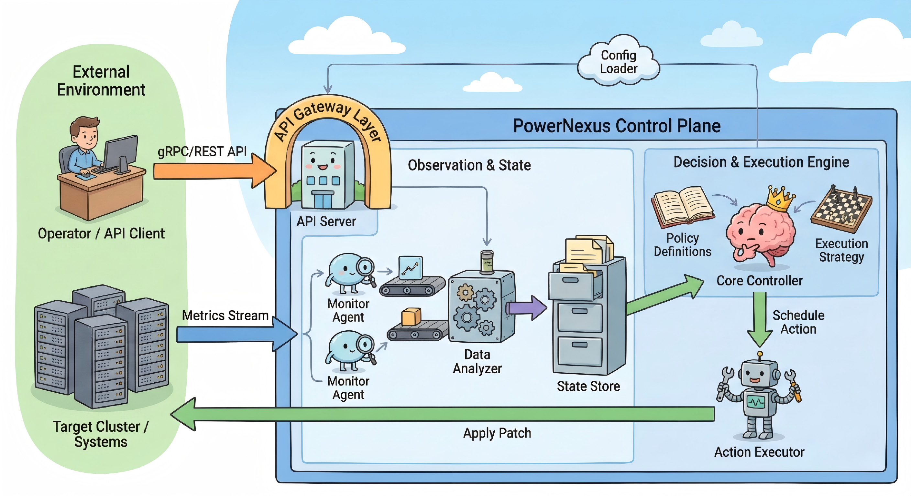
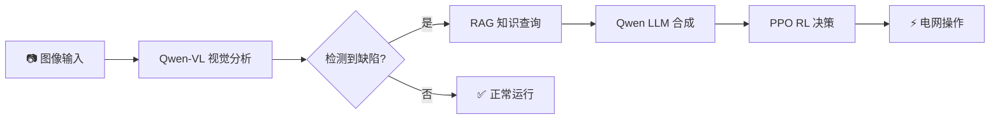

# PowerNexus ⚡

<div align="center">

[](https://www.python.org/downloads/)
[](https://pytorch.org/)
[](https://opensource.org/licenses/MIT)
[](https://streamlit.io/)
[](https://github.com/rte-france/Grid2Op)

**基于 Qwen2.5 的电网智能巡检与决策系统**

[English](README.md) | 中文文档



</div>

---

## 📖 项目概述

**PowerNexus** 是一个集成了先进人工智能技术的电网智能巡检与决策支持系统：

| 组件 | 技术 | 功能描述 |
|------|------|----------|
| 🔍 **视觉分析** | Qwen2.5-VL | 从图像中检测设备缺陷 |
| 📚 **知识检索** | RAG + Embeddings | 查询技术标准和操作手册 |
| 🤖 **强化学习优化** | PPO + Grid2Op | 优化电网拓扑决策 |
| 💬 **LLM 合成** | Qwen2.5 | 生成人类可读的解释说明 |

### 核心工作流：看 → 想 → 决 → 行



---

## ✨ 功能特性

### 🔍 视觉分析模块
- **Qwen2.5-VL API** 集成，用于缺陷检测
- 支持绝缘子、变压器、导线等电力设备
- 自动严重程度评估和置信度评分

### 📚 RAG 知识库
- ChromaDB 向量存储 + sentence-transformers 嵌入
- 支持 PDF/TXT/Markdown 文档摄入
- 基于检索上下文的 LLM 合成答案

### 🤖 强化学习引擎
- 基于 Stable-Baselines3 的 **PPO 算法**
- **Grid2Op** IEEE 14 节点系统仿真环境
- 拓扑优化实现负载均衡
- LLM 生成的动作解释

### 📊 Streamlit 仪表板
- 实时模型状态监控
- 交互式电网状态可视化
- 一键训练和评估

---

## 🚀 快速开始

### 环境要求

- **Python**: 3.10 或更高版本
- **CUDA**: 11.8+（可选，用于 GPU 加速）
- **内存**: 建议 16GB RAM

### 安装步骤

```bash
# 克隆仓库
git clone https://github.com/TanXiaoke/PowerNexus.git
cd PowerNexus

# 创建虚拟环境（推荐）
conda create -n powernexus python=3.10
conda activate powernexus

# 安装依赖
pip install -r requirements.txt
```

### 配置

编辑 `config/config.yaml` 设置 API 端点：

```yaml
# Qwen-VL 视觉模型 API
qwen_vl:
  api_base_url: "http://localhost:8120/v1"
  model_name: "Qwen2.5-VL-7B-Instruct"

# Qwen LLM API
qwen_llm:
  api_base_url: "http://localhost:8120/v1"
  model_name: "Qwen2.5-VL-7B-Instruct"

# RAG 嵌入模型 API
rag:
  embedding_api_base_url: "http://localhost:8116/v1"
  embedding_model: "all-MiniLM-L6-v2"
```

---

## 📋 项目运行流程

### 第一步：生成电网状态数据

```bash
python tools/generate_ppo_data.py --samples 1000
# 或者
python tools/simulate_grid_state.py -n 1000 -s mixed -o data/grid_states.npz
```

### 第二步：训练 PPO 模型（可选）

```bash
# 使用 Mock 环境快速测试
python tools/train_ppo.py --timesteps 2048 --use-mock

# 使用 Grid2Op 完整训练
python tools/train_ppo.py --timesteps 100000 --eval-episodes 5
```

### 第三步：摄入知识库文档

```bash
# 将文档放入 data/manuals/ 文件夹，然后执行：
python tools/ingest_pdf.py data/manuals/你的文档.pdf
```

### 第四步：启动仪表板

```bash
streamlit run src/app.py
```

在浏览器中打开 `http://localhost:8501`

---

## 🏗️ 项目结构

```
PowerNexus/
├── config/
│   ├── config.yaml           # 主配置文件
│   ├── settings.py            # Python 配置加载器
│   └── __init__.py
├── src/
│   ├── app.py                 # Streamlit 仪表杭
│   ├── main.py                # 主入口
│   ├── perception/            # 视觉模块
│   │   ├── __init__.py
│   │   └── vision_model.py    # Qwen2.5-VL 集成
│   ├── rag/                   # RAG 模块
│   │   ├── __init__.py
│   │   ├── ingest.py          # 文档摄入
│   │   └── retriever.py       # 知识检索
│   ├── rl_engine/             # 强化学习模块
│   │   ├── __init__.py
│   │   ├── agent.py           # PPO 智能体
│   │   └── env_wrapper.py     # Grid2Op 环境封装
│   └── utils/
│       ├── __init__.py
│       └── llm_engine.py      # Qwen LLM 引擎
├── tools/
│   ├── train_ppo.py           # PPO 训练脚本
│   ├── generate_ppo_data.py   # 数据生成脚本
│   ├── simulate_grid_state.py # 电网状态仿真
│   ├── ingest_pdf.py          # PDF 摄入工具
│   └── generate_mock_data.py  # Mock 数据生成器
├── data/
│   ├── grid_states.npz        # 预生成的电网状态
│   ├── images/                # 示例图片
│   ├── manuals/               # 技术文档
│   └── vector_db/             # ChromaDB 向量存储
├── models/
│   └── rl/                    # 保存的 PPO 模型
├── docs/                      # 文档
├── requirements.txt
├── README.md                  # 英文文档
├── README_zh.md               # 中文文档
└── LICENSE
```

---

## 📦 主要依赖

| 包名 | 版本 | 用途 |
|------|------|------|
| torch | ≥2.0.0 | 深度学习框架 |
| transformers | ≥4.41.0 | Hugging Face 模型 |
| openai | ≥1.0.0 | LLM/VL API 客户端 |
| stable-baselines3 | ≥2.0.0 | PPO 算法 |
| grid2op | ≥1.10.0 | 电网仿真 |
| chromadb | ≥0.4.0 | 向量数据库 |
| streamlit | ≥1.30.0 | Web 仪表板 |
| sentence-transformers | ≥2.2.0 | 文本嵌入 |

完整依赖列表请参阅 [requirements.txt](requirements.txt)。

---

## 📸 界面截图

<div align="center">

| 视觉检测 | 知识检索 | RL 优化 |
|:--------:|:--------:|:-------:|
|  |  |  |

</div>

---

## 🙏 致谢

本项目基于以下优秀的开源项目构建：

- [**Qwen2.5**](https://github.com/QwenLM/Qwen2.5) - 阿里巴巴通义千问大语言模型
- [**Grid2Op**](https://github.com/rte-france/Grid2Op) - 法国电网公司 RTE 的电网仿真平台
- [**Stable-Baselines3**](https://github.com/DLR-RM/stable-baselines3) - 强化学习算法库
- [**LangChain**](https://github.com/langchain-ai/langchain) - LLM 应用开发框架
- [**ChromaDB**](https://github.com/chroma-core/chroma) - AI 原生嵌入数据库
- [**Streamlit**](https://streamlit.io/) - Web 应用框架

特别感谢 **Google Gemini** 在开发过程中的 AI 辅助。

---

## ⚠️ 免责声明

1. **仅供研究使用**：本项目仅用于研究和教育目的。

---

## 📄 许可证

本项目采用 **MIT 许可证** - 详情请参阅 [LICENSE](LICENSE) 文件。

---

## 📮 联系方式

- **作者**: TanXiaoke
- **GitHub**: [github.com/TanXiaoke/PowerNexus](https://github.com/TanXiaoke/PowerNexus)
- **问题反馈**: 请在 GitHub 上提交 Issue

---

<div align="center">

**PowerNexus** © 2025 | Powered by Qwen2.5 | 作者: **TanXiaoke**

⭐ 如果觉得有用，请给个 Star！

</div>
